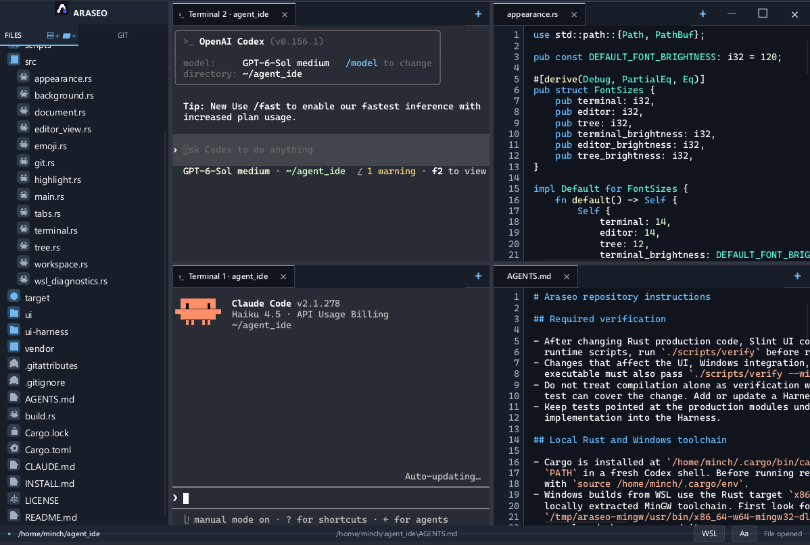
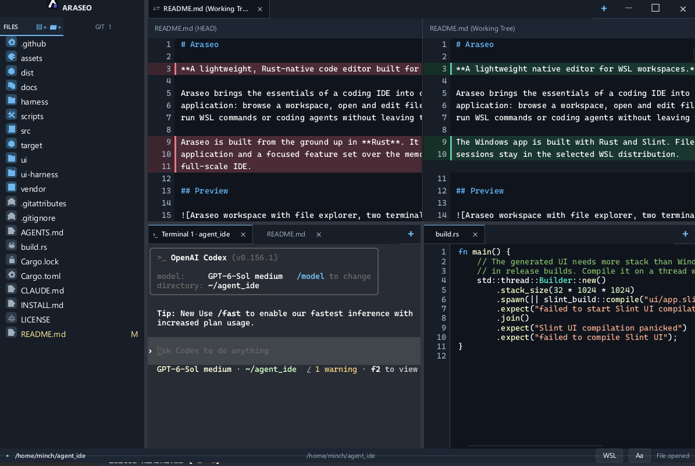

# Araseo

**A lightweight native editor for WSL workspaces.**

Araseo brings the essentials of a coding IDE into one fast, focused desktop
application: browse a workspace, open and edit files, inspect Git changes, and
run WSL commands or coding agents without leaving the window.

The Windows app is built with Rust and Slint. Files, Git commands, and terminal
sessions stay in the selected WSL distribution.

## Preview



Two terminal sessions alongside source files in a split workspace.



A Git change compared between `HEAD` and the working tree, with a terminal and
source file open in the panes below.

## What it does

- Browse a lazy-loading file tree. Create or rename entries, delete them after
  confirmation, copy a Linux path, or drop files from Windows Explorer.
- Edit files in tabs with line numbers, syntax highlighting, find, undo and
  redo. Open files are refreshed when disk changes are detected; unsaved edits
  are protected by a reload or overwrite choice.
- Inspect changes in Git repositories nested inside the workspace. Open a
  side-by-side diff or discard a change after confirmation.
- Run independent WSL terminals in tabs. PTY and VT100 rendering support
  interactive programs, ANSI colors, Korean text, IME input, and selection.
- Arrange file, diff, and terminal tabs in repeatable horizontal or vertical
  splits, with a separate tab bar and resizable dividers in each pane.
- Open read-only WSL diagnostics from the status bar, including disk, memory,
  processes, running distributions, Git, and available Docker information.

## Install and open a workspace

Araseo requires Windows 10 version 1809 or newer, or Windows 11, with WSL2.
Ubuntu is the documented setup. The terminal uses `/bin/bash` and
`/usr/bin/script`, and automatic file and Git refresh uses `/usr/bin/python3`
inside the selected distribution.

From WSL, install the newest release with:

```bash
curl -fsSL https://github.com/mincheol-lee/araseo/releases/latest/download/install.sh | sh
araseo .
```

Run `araseo path/to/project` to open another directory, or
`araseo path/to/file.rs` to open a file in its parent directory. The launcher
uses the current WSL distribution and converts the path for the Windows app.

The install command also updates an existing installation. It verifies release
checksums, places the executable under Windows LocalAppData, and installs the
`araseo` launcher in `~/.local/bin`. See [INSTALL.md](INSTALL.md) for pinned
versions, manual installation, and removal.

## Using Araseo

- Click a file in the tree to open it. Use the **FILES** toolbar or an item's
  context menu for file operations. Drag a file from the tree into a terminal
  to paste its Linux path.
- Press `Ctrl+S` to save, `Ctrl+F` to find in the active file, and `Ctrl+Z`
  or `Ctrl+Y` to undo or redo. `Ctrl+Tab` and `Ctrl+Shift+Tab` cycle tabs.
- Select **GIT** in the sidebar to browse changed and untracked files. Click
  a change to open its diff.
- Drag a tab to a pane edge to split the workspace, or to the center of a pane
  to move it there. Drag a divider to resize the panes. Use **+** in a pane's
  tab bar to start another terminal.
- Use **Aa** in the status bar to set terminal, editor, and file tree font size
  and brightness independently; **Reset defaults** restores the initial values.
  Use **WSL** to request environment diagnostics.

The editor accepts UTF-8 text files up to 2 MiB and preserves LF or CRLF line
endings. Binary files and files with invalid UTF-8 cannot be edited. Araseo
opens one workspace per window; language-server features and extensions are
outside its current scope.

## Development

Prerequisites:

- Rust stable
- Windows 10 1809+ or Windows 11
- WSL2 with an Ubuntu distribution

Build the native application on Windows:

```powershell
.\scripts\build-windows.ps1
```

This produces `dist/araseo.exe`.

The PowerShell build script runs the core Harness tests before building the
Windows executable. For a development checkout, put `scripts/araseo` on the WSL
`PATH`; it will use `dist/araseo.exe`. If the executable is elsewhere, set
`ARASEO_EXE` to its WSL interop path:

```bash
export ARASEO_EXE=/mnt/c/Tools/Araseo/araseo.exe
araseo .
```

For UI development on Linux/WSLg, `cargo run -- .` opens the current Linux
directory and uses a Unix PTY instead of ConPTY.

Ubuntu development builds require Fontconfig and pkg-config headers:

```bash
sudo apt install pkg-config libfontconfig1-dev libxkbcommon-dev libwayland-dev
```

Run the core and Slint UI Harness tests, plus release installer tests:

```bash
./scripts/verify
```

The tests use the production modules for editor, file tree, workspace, Git,
terminal, and UI behavior. On Linux, this command needs the `libfontconfig1`
runtime library, but not the UI development headers.

Set `ARASEO_UI_SNAPSHOT_DIR` to have the UI Harness write PNG snapshots of key
editor, terminal, dialog, Git diff, and split-pane states:

```bash
ARASEO_UI_SNAPSHOT_DIR=/tmp/araseo-ui-snapshots ./scripts/verify
```

Before distributing a Windows build, also compile every test and the Slint UI
for the Windows target. From WSL, this requires the
`x86_64-pc-windows-gnu` Rust target and a MinGW-w64 cross compiler:

```bash
./scripts/verify --windows
```

Pushing a `v`-prefixed tag matching the version in `Cargo.toml` runs the
release workflow: it verifies Linux and Windows targets, builds the Windows
executable, and publishes the GitHub Release assets. A suffix such as
`-beta.1` marks a pre-release.

The app uses Rust for workspace, document, Git, and terminal logic and Slint
for its native UI. Workspace startup, file loading, tree scanning, and syntax
highlighting run on background workers. The manual presentation microbenchmark
is `cargo test --manifest-path ui-harness/Cargo.toml benchmark_edit_presentation -- --ignored --nocapture`;
it measures part of the editor update path, not end-to-end typing latency.

Font settings are saved in `%LOCALAPPDATA%/araseo/fonts.conf` on Windows or
`$XDG_CONFIG_HOME/araseo/fonts.conf` on Linux (default:
`~/.config/araseo/fonts.conf`). The original MVP specification is in
[docs/PRD.md](docs/PRD.md); it predates several features described here.

## Support

If Araseo is useful to you and you'd like to support its development, you can
[buy me a coffee](https://buymeacoffee.com/mclee). Araseo remains free to use.
